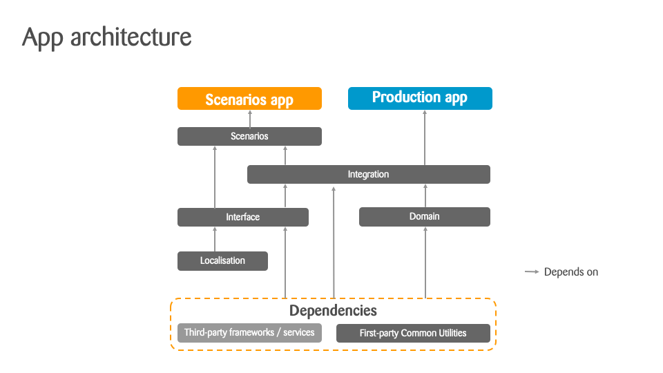
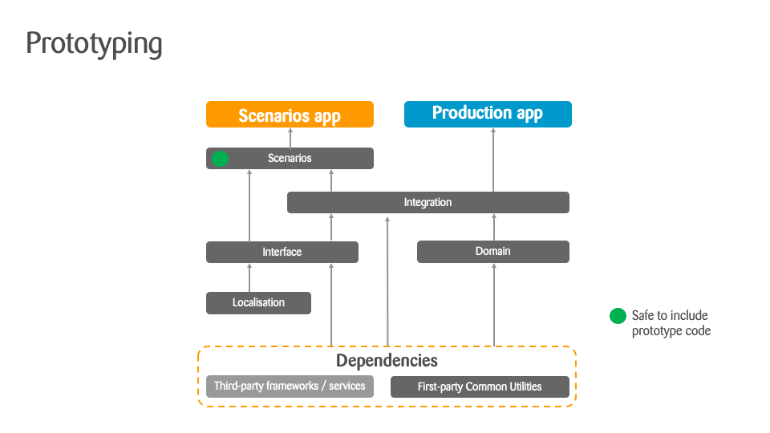
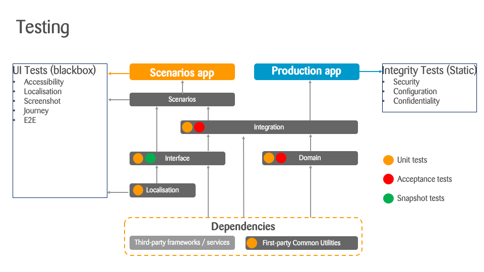

# App Architecture

This diagrams below shows a summary of the application architecture. The rest of this document goes into more details to describe these modules

  
App Modules

  
  The “app” boxes represent an Xcode app target. Each grey box is a Swift module.
  
  
  

  
Prototyping

  
  We include prototype code as part of the Scenarios module and make them available in the Scenarios app, with confidence that they will not affect the Production app.
  
  
  

  
Testing

  
  This diagram summarises the testing for the app.
  
  
  

<!-- START doctoc generated TOC please keep comment here to allow auto update -->
<!-- DON'T EDIT THIS SECTION, INSTEAD RE-RUN doctoc TO UPDATE -->

- [Apps](#apps)
- [Modules](#modules)
  - [Common](#common)
    - [Testing Strategy](#testing-strategy)
  - [Localization](#localization)
    - [Testing Strategy](#testing-strategy-1)
  - [Interface](#interface)
    - [Testing Strategy](#testing-strategy-2)
  - [Domain](#domain)
    - [Testing Strategy](#testing-strategy-3)
  - [Integration](#integration)
    - [Testing Strategy](#testing-strategy-4)
  - [Scenarios](#scenarios)

<!-- END doctoc generated TOC please keep comment here to allow auto update -->

## Apps

We produce two separate apps from this codebase.

The “Production” app is the app that is uploaded to App Store, and is always only configured for production. For example, there are no testing features, insecure logging, or internal assets.

The “Scenarios” app is used internally by developers and other members of the team. It provides additional features that are useful for testing, such as mock and non-production environments.

Scenarios also offer a way for the development team as well as the stakeholders a way to easily go through design and various flows.

## Modules

  
Sidenote

  
Currently there is one violation of the separation of the modules. Specifically, `Domain` module has a dependency on `Localisation`.

We consider this an acceptable as it does not stop us from providing the level of testing we need. However, we aim to fix this and return to the target architecture when possible.
  

### Common

Contains common code available to all other packages.

#### Testing Strategy

* Logic is unit tested (`CommonTests`)

### Localization

A small package focuses on localisation.

#### Testing Strategy

* App tests ensure all necessary localised assets (such as texts) are specified (`AppTests`)

### Interface

The app “frontend” logic. It depends on `Localization` package. It should be possible to “use” all of the UI  with mocks.

#### Testing Strategy

* State management, such as in presenters, are unit tested (`InterfaceTests`)
* Layout of individual screens / components are snapshot tested (TODO)
* Interactions, localisation, and accessibility are tested with UI tests (`UITests`). These are further divided into these categories.
 * Screen tests ensure internal interactions in a single screen are correct (for example, that a form validation errors are displayed).
 * Flow tests ensure a group of screens work together as expected (for example, that a popover screen is shown at the right time).
 * Journey tests ensure a complete user journey works (for example, that the user can go through onboarding).
 
Choosing the correct strategy for a given feature is often a judgement call. As a general rule, try to use earlier strategies in this list where possible to speedup testing.

### Domain

The app “backend” logic. This includes IO (networking, storage, etc.) as well as business logic (non-UI state management).

#### Testing Strategy

* Majority of the code is unit tested (`DomainTests`).
* Where testing an individual unit is is not possible, the subsystem will be tested with integration tests internal to the module (`DomainTests`).

### Integration

This package contains the “glue” that connects the app’s UI to its core logic.

#### Testing Strategy

* Where possible, the code is unit tested (`IntegrationTests`).
* Where testing an individual unit is is not possible, the subsystem will be tested with integration tests internal to the module (`IntegrationTests`).
* Where integration affects UI, this is tested via “Journey” tests (`UITests`).

### Scenarios

This module contains code to set up internal app, with additional functionality to help development and the rest of the team.

This is also used heavily to drive the UI tests.
